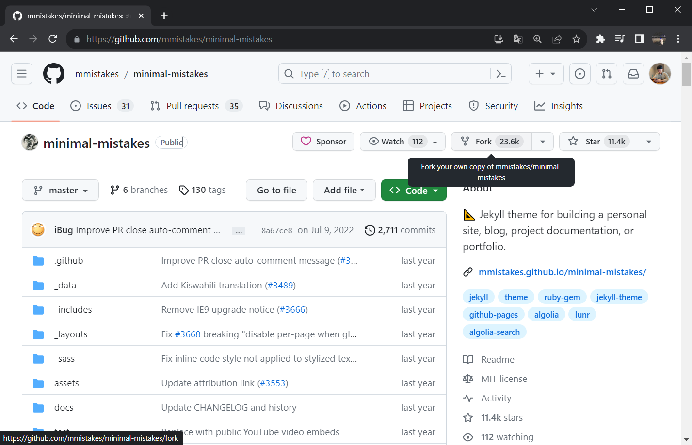
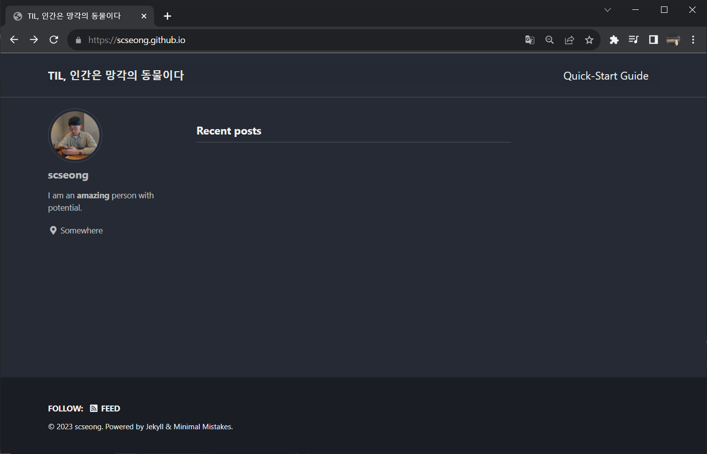
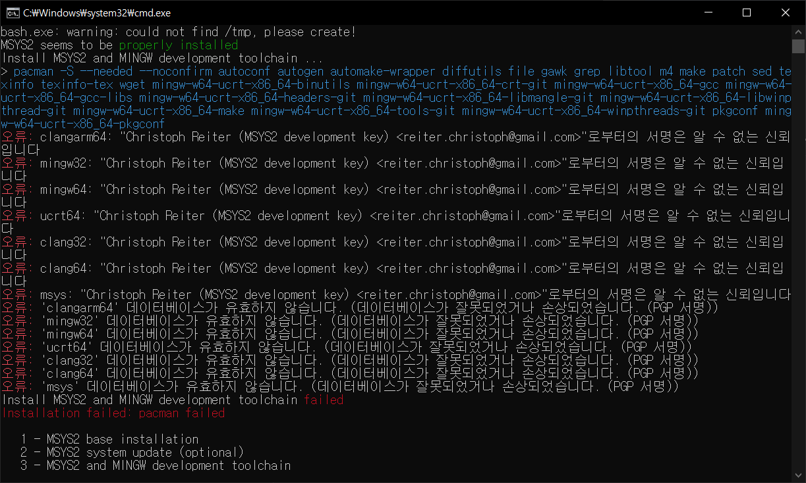
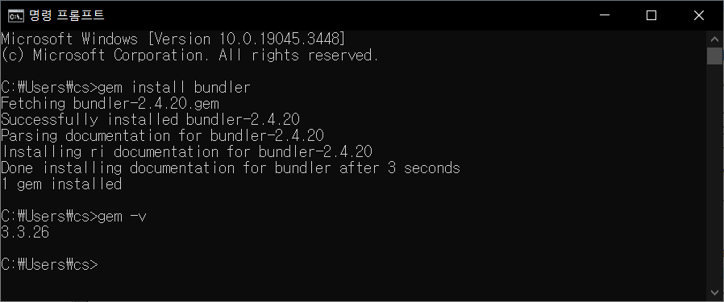
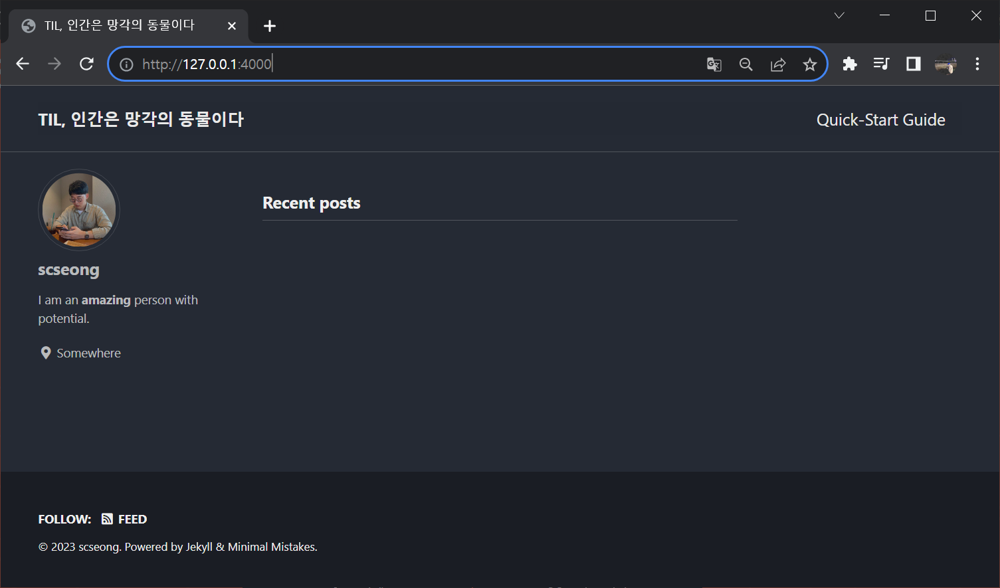
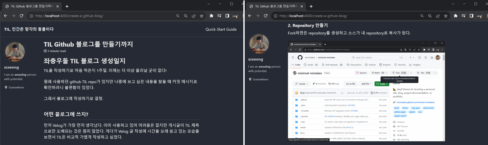

---

layout: single

title: "TIL Github 블로그 만들기"

---

# 좌충우돌 TIL 블로그 생성일지

TIL을 작성하기로 마음 먹은지 1주일. 이제는 더 이상 물러날 곳이 없다!

원래 사용하던 github TIL repo가 있지만 나중에 보고 싶은 내용을 찾을 때 커밋 메시지로 확인하려니 불편함이 있었다.

그래서 블로그에 작성하기로 결정.

## 어떤 블로그에 쓰지?

먼저 Velog가 가장 먼저 생각났다. 이미 사용하고 있어 어려움은 없지만 게시글이 TIL 제목으로만 도배되는 것은 원치 않았다. 게다가 Velog 글 작성에 시간을 오래 쏟고 있는 모습을 보면서 TIL은 비교적 가볍게 작성하고 싶었다.

github은 계속 관리할테고 잔디도 심으면서 템플릿을 활용해 간단히 만들 수 있어 **github blog**를 사용하기로 했다.

(+) 대부분의 기록을 markdown으로 하고 있기도 했다.

## 깃헙 블로그(Github blog)

깃헙 블로그는 Github Pages를 사용하여 만든 블로그이다. Github Pages란 Github에서 제공하는 웹 호스팅 서비스로 무료로 웹사이트를 만들 수 있다.

### 깃헙 블로그 만들기

그렇다면 처음부터 만들어야 하는가?

이미 훌륭하신 분들이 다 만들어 두었다.

#### 1. 블로그 테마 고르기

깃헙 페이지는 기본적으로 Jekyll을 사용하여 사이트를 구축한다. 깃헙 페이지에 Jekyll 테마를 추가하여 원하는 디자인을 적용할 수 있다.

> [GitHub Pages](https://pages.github.com/) 는 *Jekyll 로 작동* 하기 때문에, GitHub 을 사용하여 쉽게, 무료로 자신의 사이트를 게시할 수 있습니다 - [https://jekyllrb-ko.github.io/](https://jekyllrb-ko.github.io/)

구글에 검색하면 많이 나오지만 github Topics에서 Star가 가장 많은 [minimal-mistakes](https://github.com/mmistakes/minimal-mistakes)를 선택했다.

##### (+) Jekyll이란?

평범한 텍스트 파일을 정적 웹사이트로 만들어준다. 즉, HTML, CSS, Javascript가 아닌 markdown을 사용해 웹사이트를 생성할 수 있다.

> Jekyll 은 정적 사이트 생성기입니다. 당신이 즐겨 사용하는 마크업 언어로 작성된 텍스트를 Jekyll 에 넘겨주면 레이아웃을 사용해 정적 웹사이트를 생성합니다. 사이트 URL 의 형식이나 어떤 데이터를 사이트에 표시할 것인지 등, 여러 동작을 조정할 수 있습니다. - [jekyll](https://jekyllrb-ko.github.io/docs/)

#### 2. Repository 만들기

Fork하면은 repository를 생성하고 소스가 내 repository로 복사가 된다.



repository 이름은 반드시 `{username}.github.io`으로 생성한다. GitHub Pages가 호스팅하는 기본 repository 이름 형식이 `{username}.github.io` 이기 때문.


생성된 저장소를 clone해서 로컬에 복제한다.

#### 3. `_config.yml`파일 수정

소스코드가 복사된 저장소가 생겼다. 기쁜 마음에 URL을 치고 들어갔으나 404 Not Found.

아직 설정이 남았다. `_config.yml` 파일을 편집하여 사이트 테마, 플러그인 등 대부분의 Jekyll 설정을 변경할 수 있다.

> 참고: [Configuration - Minimal Mistakes](https://mmistakes.github.io/minimal-mistakes/docs/configuration/)

필수로 변경해야 할 것은 24 line의 url을 자신의 github page 주소로 변경해야 한다.

```yml
24: url: "https://scseong.github.io"
```

▶ dark 테마를 적용, 여러 설정값을 변경한 결과



블로그가 생겼다.

#### 4. 로컬 개발환경 설정하기

변경사항을 push해야 반영되기 때문에 변경될 때까지 시간이 걸리고 이전에 어떻게 변경되는지 알 수 없다.

로컬에서 서버를 띄워 실시간으로 확인하며 마지막에 push할 수 있도록 로컬 개발환경을 구축한다. [Installation Jekyll](https://jekyllrb.com/docs/installation/)를 참고했다.

- [Download Ruby](https://www.ruby-lang.org/en/downloads/)
  
  - Windows/Mac -> Download -> WITH DEVKIT의 최신 버전 (23. 10. 11 기준 <s>~~3.2.2-1~~</s> 3.1.4-1)
  
  - 설치 후 실행 -> 창이 뜨면 3번째 Enter -> Install
  
  - 에러가 발생했다

- Ruby+Devkit 3.2.2-1 (x64)에서 Ruby+Devkit 3.1.4-1 (x64) 으로 버전을 낮추어 설치했다

- cmd창에 `$ ruby -v` 쳐서 버전이 나오면 설치된 것

- jekyll 설치
  
  - (windows 기준) Window + R -> cmd -> `gem install jekyll`
  
  - `gem install bundler`
  
  - 

- 로컬에서 실행
  
  - 로컬의 clone한 폴더에서 cmd창을 띄운다
  
  - `bundle install`
  
  - `bundle exec jekyll serve --livereload`
  
  - `http://127.0.0.1:4000/`로 접근하면 로컬에서 실시간으로 변경사항이 반영된다

▶ 결과



#### 5. 포스팅

파일명을 `_posts/0000-00-00-filename.md` 양식으로 작성해서 push하면 포스트가 생성된다.

- `_post`는 블로그 게시물 폴더. markdown으로 게시물 작성

- `YEAR-MONTH-DAY-title.md`: 파일명 양식
  
  - title은 url의 주소가 된다 (게시물 머리말이 없을 경우 제목으로 설정)

모든 블로그 게시물 파일은 일반적으로 레이아웃이나 기타 메타데이터를 설정하는 데 사용되는 머리말로 시작해야 한다.

> [YAML](https://yaml.org/) 머리말 블록을 포함하는 모든 파일은 Jekyll에서 특수 파일로 처리됩니다. 머리말은 파일에서 첫 번째 항목이어야 하며 삼중 점선 사이에 설정된 유효한 YAML 형식을 취해야 합니다. [Front Matter - Jekyll](https://jekyllrb.com/docs/front-matter/)

```markdown
---
layout: single
title: TIL Github 블로그 만들기
---
```

- layout: 사용할 레이아웃 파일. `_layouts` 폴더에 있음

- title: 게시글 제목 설정

이미지를 첨부하고 싶다면 `assets` 폴더에 이미지를 저장한 후 경로를 지정하면 된다.

```markdown

```

▶ 현재 디렉토리 구조

```markdown
📦scseong.github.io
 ┣ 📂.git
 ┣ 📂.github
 ┣ 📂.jekyll-cache
 ┣ 📂assets
 ┃ ┣ 📂css
 ┃ ┣ 📂images
 ┃ ┃ ┣ 📜2023-10-11-1.png
 ┃ ┃ ┣ 📜2023-10-11-2.png
 ┃ ┃ ┣ 📜2023-10-11-3.png
 ┃ ┃ ┣ 📜2023-10-11-4.png
 ┃ ┃ ┣ 📜2023-10-11-5.png
 ┃ ┃ ┣ 📜2023-10-11-6.png
 ┃ ┃ ┗ 📜profile.jpg
 ┃ ┗ 📂js
 ┣ 📂_data
 ┣ 📂_includes
 ┣ 📂_layouts
 ┣ 📂_posts
 ┃ ┗ 📜2023-10-11-create-a-github-blog.md
 (생략)
```

게시글은 `_post` 폴더에 있으므로 `profile.jpg` 이미지를 첨부하려면 다음과 같이 작성한다.  ``

▶ 결과 미리보기

 

## 정리

github pages를 이용해 블로그를 만들어보았다. 중간중간 에러와 많은 설정들로 삽질을 해야했지만 목표를 달성했다.

아직 설정하지 못한 부분도 많고 TIL을 어떤 방식으로 작성할지도 고민이다. 하지만 시작이 반이랬다. 매일의 기록으로 나만의 docs를 만들어 나갈 것이다.

ps. 첫 글이라 너무 힘썼다. 다음부턴 자중할 것!

## Reference

- [깃헙(GitHub) 블로그 10분안에 완성하기 - YouTube](https://www.youtube.com/watch?v=ACzFIAOsfpM)

- [About GitHub Pages and Jekyll - GitHub Docs](https://docs.github.com/en/pages/setting-up-a-github-pages-site-with-jekyll/about-github-pages-and-jekyll)

- [Quickstart Jekyll](https://jekyllrb.com/docs/)

- [Installation - Minimal Mistakes](https://mmistakes.github.io/minimal-mistakes/docs/installation/)